# LabyrinthLoom
# Labyrinth Loom / 迷宫织机

> 一个可复现种子的程序化 3D 地牢生成器与探索器，使用 Vite、TypeScript、Three.js 和 Electron 构建。

Labyrinth Loom 会在每次生成时自动创建房间、走廊、门框、墙体、天花板、火把、宝箱、石柱与场景装饰。生成结果完全由种子驱动：相同种子会得到相同的网格、房间、走廊、门、道具位置和几何布局。项目不依赖外部 `.glb`、`.gltf`、`.fbx`、贴图或字体文件，石材、蛛网、尘埃、火焰与装饰全部由代码生成。

项目同时提供 Web 版本和 Windows 桌面版本，并暴露结构化数据接口，便于后续接入 AI 生成、自动化测试、地图分析或其它可视化系统。


## 项目亮点

- **确定性生成**：使用 FNV-1a 与 Mulberry32，确保相同字符串种子得到相同布局。
- **完整房间连通性**：使用 Prim 最小生成树保证所有房间可达，并额外生成少量环路。
- **正交走廊系统**：每个房间由带单次转折的宽走廊连接，适合网格验证与 3D 可视化。
- **多种程序化道具**：火把、宝箱、石柱、碎石、蜘蛛网和青苔。
- **纯代码美术**：石材纹理、砖缝、污渍、裂纹、尘埃和蛛网均在浏览器中生成。
- **交互式对象检视**：点击房间、门框、火把、宝箱、石柱和装饰物可高亮并查看详情。
- **完整中文 UI**：玻璃拟态控制台、实时统计面板、自适应布局与移动端压缩布局。
- **Web 与桌面双端**：Vite 构建静态 Web 应用，Electron 输出 Windows 便携版 EXE。
- **面向自动化**：完整结构化数据可通过 `window.__DUNGEON__`、`getDungeonData()` 与 `regenerate(seed)` 访问。

## 功能详解

### 1. 程序化地牢生成

每次点击“刷新未知地牢”都会创建一个新的随机种子，并重新生成：

- 不重叠的矩形房间。
- 房间中心之间的连通图。
- 保证全房间可达的 Prim 最小生成树。
- 增加少量额外连接以形成环路。
- 宽度为 2 格的折线走廊。
- 房间与走廊交界处的门。
- 房间及走廊周围的一格石墙。
- 火把、宝箱、石柱、碎石、蜘蛛网与青苔。

用户可以输入任意文本种子进行复现，例如：

```text
dragon-vault-2026
blue-keep
迷雾矿坑
2026-09-20
```

### 2. 种子复现

生成过程不依赖系统时间或全局随机状态，只依赖种子字符串。相同种子会生成相同的：

- 地图宽高。
- 房间数量、位置和尺寸。
- 走廊路径和连接关系。
- 门的位置与朝向。
- 道具类型、位置、旋转和缩放。
- 地板、墙体和门网格。
- 火把亮度、变体和装饰细节。

`generationTimeMs` 属于运行时性能遥测，可能因设备不同而变化；自动化比较布局时应忽略该字段。

### 3. 360° 3D 探索

使用 OrbitControls 提供完整的相机控制：

- 左键拖拽环绕旋转。
- 滚轮缩放。
- 右键拖拽平移。
- 自动旋转模式。
- 可调自动旋转速度。
- 聚焦选中对象或随机房间。

### 4. 对象点击与信息检视

场景中的可交互对象包括：

| 对象 | 可查看信息 |
| --- | --- |
| 石室 | 编号、尺寸、面积、中心坐标 |
| 门框 | 连接房间、朝向、网格坐标 |
| 火把 | 编号、位置、缩放、所属房间 |
| 宝箱 | 编号、位置、缩放、所属房间 |
| 石柱 | 编号、位置、缩放、所属房间 |
| 碎石 | 编号、网格位置与所属区域 |
| 青苔 | 编号、网格位置与所属区域 |
| 蛛网 | 编号、网格位置与所属区域 |

点击对象后会显示蓝色包围框高亮，并在右侧信息面板展示详情。

### 5. 显示与分析模式

- **线框模式**：观察网格、房间轮廓和实例化结构。
- **隐藏天花板**：从上方查看完整平面布局。
- **动态剖切**：沿当前相机方向裁切近侧结构，查看内部空间。
- **辉光后处理**：按需开启 Bloom 和暗角效果。
- **聚焦按钮**：快速定位到选中对象或随机房间。
- **性能自适应**：低帧率时自动降低内部渲染分辨率。

## 操作方式

| 操作 | 功能 |
| --- | --- |
| 鼠标左键拖拽 | 围绕地牢 360° 旋转 |
| 鼠标滚轮 | 拉近或拉远相机 |
| 鼠标右键拖拽 | 平移观察中心 |
| 点击对象 | 选中、高亮并显示结构化信息 |
| `R` | 生成一个全新的随机地牢 |
| `F` | 聚焦当前选中对象；未选中时聚焦随机房间 |
| 刷新未知地牢 | 使用新的时间熵种子重新生成 |
| 种子输入框 + `Enter` | 按指定种子重新生成 |
| `⧉` 按钮 | 复制当前种子 |
| 自动旋转 | 开关相机环绕 |
| 旋转速度 | 调整自动旋转速度 |
| 线框模式 | 切换建筑与道具线框显示 |
| 显示天花板 | 隐藏或显示顶部结构 |
| 动态剖切 | 沿相机视线裁切近侧建筑 |
| 辉光后处理 | 开关 Bloom 与暗角效果 |
| 聚焦选中 / 随机石室 | 重新定位相机观察目标 |


## 快速开始

### 环境要求

- Node.js `22.12+`
- npm `10+`
- 支持 WebGL 的现代浏览器
- Windows 桌面打包需要 Windows 10/11

## 地牢生成算法

生成核心位于：

```text
src/core/dungeonGenerator.ts
```

整体流程：

```mermaid
flowchart LR
  A[字符串种子] --> B[FNV-1a 32 位哈希]
  B --> C[Mulberry32 随机序列]
  C --> D[拒绝采样放置房间]
  D --> E[构建房间完全图]
  E --> F[Prim 最小生成树]
  F --> G[添加少量环路]
  G --> H[生成正交折线走廊]
  H --> I[标记门与房间边界]
  I --> J[膨胀生成石墙]
  J --> K[生成火把与装饰]
  K --> L[输出 DungeonData]
```



### 1. 确定性随机数

项目使用 FNV-1a 把任意字符串转换为稳定的 32 位无符号整数，再用 Mulberry32 产生随机序列。这个过程不依赖浏览器实现差异，因此相同种子在不同会话中会得到相同结果。

### 2. 房间放置

生成器在有限地图范围内使用拒绝采样：

- 房间为矩形。
- 房间之间保留石墙间距。
- 尽量避免贴边。
- 候选房间不得与已有房间重叠。
- 房间生成后按坐标排序，确保稳定编号。

### 3. 房间连接

连接过程分为两步：

1. 以全部房间中心构建带权完全图。
2. 使用 Prim 算法生成最小生成树，确保所有房间至少有一条可达路径。
3. 从剩余边中随机选择少量额外连接，形成环路，减少树状死路感。

### 4. 走廊生成

两个房间之间使用只包含一次转折的正交路径：

- 先水平后垂直，或先垂直后水平。
- 走廊默认宽度为 `2` 格。
- 每个走廊都记录完整 `path` 点列表。
- 路径长度用于结构化数据和后续分析。

### 5. 门与墙体

走廊跨越房间边界的位置会生成门候选。同一个网格坐标只保留一个门，并记录：

- 连接的两个房间编号。
- 门所在的网格坐标。
- 水平或垂直朝向。

完成地板和门之后，生成器对可行走区域进行一格膨胀，得到封闭的石墙外壳。

### 6. 道具与装饰

道具由确定性随机序列生成，并写入结构化数据：

- **火把**：沿房间墙面分布，保留暖色点光源和闪烁动画。
- **宝箱**：偏向放置在房间角落，使用木质箱体与金属锁扣。
- **石柱**：大型房间中央可能生成石柱。
- **碎石**：随机分布在地板附近。
- **蜘蛛网**：使用程序化透明纹理生成。
- **青苔**：作为地表的低矮装饰层。

## 网格与结构化数据

网格使用二维数组表示，单元格值如下：

| 值 | 类型 | 含义 |
| --- | --- | --- |
| `0` | EMPTY | 空区域 |
| `1` | FLOOR | 可行走地板 |
| `2` | WALL | 实体墙体 |
| `3` | DOOR | 门或房间连接口 |

### Stats

统计数据包含：

- 房间数量。
- 走廊数量。
- 门数量。
- 火把数量。
- 宝箱数量。
- 道具总数。
- 地板单元格数量。
- 墙体单元格数量。
- 本次生成耗时。


## 3D 渲染架构

### SceneManager

`src/render/SceneManager.ts` 负责：

- WebGLRenderer 初始化。
- ACES Filmic 色调映射。
- 蓝色指数雾与深蓝背景。
- PerspectiveCamera 与 OrbitControls。
- 半球光、环境光和方向光。
- 静态阴影配置。
- 动态剖切平面。
- 自适应渲染比例。
- 后处理尺寸同步。

### DungeonBuilder

`src/render/DungeonBuilder.ts` 把结构化地牢转换为 Three.js 对象：

- 地板实例。
- 墙体实例。
- 天花板实例。
- 门框、门梁和门槛实例。
- 火把与火焰实例。
- 宝箱箱体、箱盖和锁扣实例。
- 石柱实例。
- 碎石、青苔和蛛网实例。
- 房间拾取代理。
- 火把点光源与闪烁数据。
- 选中对象高亮框。

### Materials 与 ProceduralTextures

`Materials.ts` 创建所有 PBR 材质：

- `MeshStandardMaterial`
- 高粗糙度
- 零或低金属度
- 冷蓝石材色
- 暖色火焰自发光
- 透明蛛网材质

`ProceduralTextures.ts` 使用 Canvas 2D 生成：

- 石材噪点。
- 交错砖缝。
- 墙面污渍。
- 地面拼缝。
- 磨损裂纹。
- 尘埃粒子光斑。
- 蜘蛛网透明纹理。

### Effects

后处理管线：

```text
RenderPass
  → UnrealBloomPass
  → Vignette Shader
  → OutputPass
```

后处理默认关闭以优先保证帧率。开启后，火焰高光和亮色边缘会产生较柔和的辉光。

### Particles

尘埃粒子使用单个 `THREE.Points` 对象：

- 数量随地图面积调整。
- 硬上限为 500。
- 使用程序化径向光斑纹理。
- 使用隔帧更新减少 CPU 开销。
- 不影响碰撞或结构化地牢数据。

## 视觉设计

项目采用冷蓝色暗黑奇幻主题：

- 深蓝背景与低密度蓝色指数雾。
- 冷蓝灰色石材与砖缝。
- 暖橙色火把光，与蓝色环境形成对比。
- 青蓝色尘埃粒子。
- 蓝色玻璃拟态 UI。
- 铜色和金色已被蓝色强调色替代。
- 所有纹理和装饰均由代码生成，不依赖外部美术资源。


## 性能策略

### InstancedMesh

重复元素使用实例化网格：

- 地板。
- 墙体。
- 天花板。
- 门柱与门梁。
- 火把。
- 火焰。
- 宝箱组件。
- 石柱。
- 碎石。
- 青苔。
- 蛛网。

这样可以显著降低 draw call 数量。

### 静态阴影

方向光阴影贴图为 `1024 × 1024`，并设置：

```ts
renderer.shadowMap.autoUpdate = false;
```

阴影只在重新生成地牢时更新，不需要每帧重绘。

### 动态点光限制

火把数量可能较多，但只选择少量火把创建动态 PointLight。其余火把保留自发光材质。这样可以保留灯光氛围，同时避免片元着色器承担过多动态光源。

### 自适应分辨率

主循环会采样 FPS：

- 低于目标帧率时降低内部渲染比例。
- 帧率恢复后逐步提高内部渲染比例。
- 最低比例受到限制，避免画面过度模糊。
- UI、CSS 和高分屏布局不受影响。

### 后处理开关

Bloom 与暗角可以完全关闭，适合低性能设备。后处理默认关闭，用户可在需要时手动开启。

### WebGL 上下文恢复

Renderer 监听 WebGL 上下文丢失与恢复事件：

- 丢失时暂停绘制。
- 恢复时重新同步尺寸与阴影。
- 状态栏显示图形上下文恢复信息。

## 设计约束

### 确定性与 UI 分离

生成器只负责数据和确定性布局。Three.js 只负责把数据转换为可交互 3D 场景。这样可以在不修改 UI 的情况下替换或测试生成算法。

### 拾取与视觉对象分离

房间使用透明拾取代理；门框、火把、宝箱等使用实例索引映射。这样不会为了点击交互额外创建大量可见 Mesh。

## 验证与测试

### 构建验证

```bash
npm run build
```

通过条件：

- TypeScript 严格模式无错误。
- Vite 生产构建成功。
- `dist/` 生成完整资源。


## 贡献

欢迎提交 Issue、功能建议和 Pull Request。
如果这个项目对你有帮助，欢迎 Star、提交 Issue 或分享使用建议。
